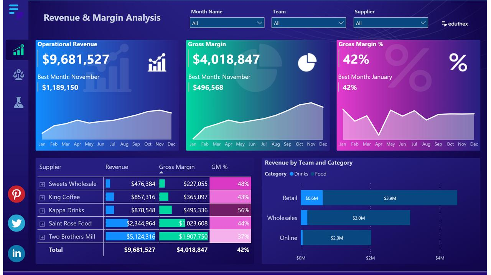

# Financial Analysis Dashboard

## Project Overview

This Power BI dashboard helps organizations monitor revenue, expenses, profit and overall financial performance.

The dashboard provides management with a clear view of business financial health through interactive visualizations and KPI tracking.

## Tools Used

* Power BI
* Excel
* Data Modeling
* DAX
* Power Query

## Business Problem

Management needed a centralized dashboard to compare Budget vs Actual performance and monitor profitability.

## KPIs

* Total Revenue
* Total Expenses
* Net Profit
* Profit Margin
* Budget Variance

## Dashboard Features

* Revenue Analysis
* Expense Analysis
* Profit Analysis
* Budget vs Actual Comparison
* Monthly Financial Trends
* Interactive Filters

## Key Insights

* Revenue increased significantly in Q3.
* Expenses were highest during year-end periods.
* Profit margins improved after cost optimization.
* Budget targets were exceeded in multiple categories.

## Dashboard Screenshot

## Future Improvements

* Forecasting Analysis
* Cash Flow Dashboard
* Financial Risk Monitoring
* AI-Based Financial Predictions

## Author

Mohit Kasana
